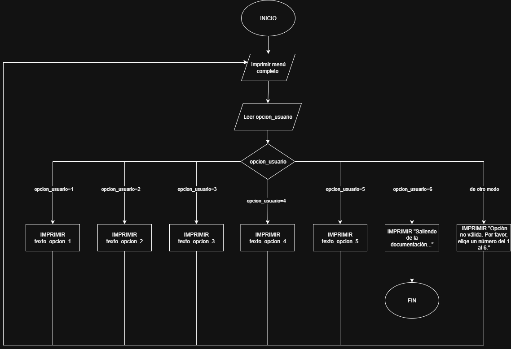

# Documentación
1ra demo: asincrónica

## 1. Tema, problema y solución

**Tema:**
Identificación de Productos 'Fríos'

**Problema:**
Nuestra base de datos actual está desorganizada, lo que nos impide identificar de manera rápida y eficiente los productos con las ventas más bajas. Esto significa que perdemos tiempo valioso y no podemos tomar decisiones ágiles para mejorar la rentabilidad.

**Solución:**
Implementaremos un reporte dinámico en Power BI que consolidará el catálogo completo de productos. Este reporte nos permitirá visualizar de forma inmediata y sencilla cuáles son los artículos menos vendidos, facilitando así la toma de decisiones estratégicas.

## 2. Dataset de referencia:

**Fuente:**
detalle_ventas

**Definición:**
detalle_ventas: Registra cuántas veces se vendió cada producto y la venta a la que está relacionada.

**tabla_ejemplo archivo.csv** ~344 filas
| Campo            | Tipo | Escala   | 
|------------------|------|----------| 
| id_venta         | int  | Nominal  | 
| id_producto      | int  | Nominal  | 
| nombre_producto  | str  | Nominal  | 
| cantidad         | int  | Razón    |
| precio_unitario  | int  | Razón    |
| importe          | int  | Razón    |

**Fuente:**
productos

**Definición:**
productos: Contiene los detalles de cada producto. 

**tabla_ejemplo archivo.csv** ~101 filas
| Campo            | Tipo | Escala   | 
|------------------|------|----------| 
| id_producto      | int  |Nominal   |
| nombre_producto  | str  |Nominal   |
| categoria        | str  |Nominal   |
| precio_unitario  | int  |Razón     |

**Fuente:**
ventas

**Definición:**
ventas: Indica los datos de clientes asociados a cada venta (fecha, email, tipo de pago).

**tabla_ejemplo archivo.csv** ~121filas
| Campo            | Tipo | Escala   | 
|------------------|------|----------| 
| id_venta         | int  |Nominal   |
| fecha            | dt   |Nominal   |
| id_cliente       | int  |Nominal   |
| nombre_cliente   | str  |Nominal   |
| email            | str  |Nominal   |
| medio_pago       | str  |Nominal   |


 
## 3. Información, pasos, pseudocódigo y diagrama del programa (Sprint 1)

### 3.1 Contenidos accesibles desde el menú

1. Tema, problema y solución.
2. Dataset de referencia. Resumen de fuente y definición.
3. Estructura por tabla. Columnas, tipo y escala de medición.
4. Escalas de medición. Descripción y ejemplos.
5. Sugerencias y mejoras con Copilot.
6. Salir.

### 3.2 Pasos
Objetivo del proceso

El propósito de este procedimiento es identificar los productos con menor rotación de ventas para optimizar la gestión del inventario y apoyar la toma de decisiones estratégicas. Para lograrlo, se combinan herramientas de análisis de datos (Python) y visualización (Power BI), garantizando resultados limpios, precisos y fáciles de interpretar.

### Paso A: El trabajo del “Ayudante Inteligente” 🐍 (con Python)

1. Análisis y carga de los datos
El primer paso consiste en examinar los archivos fuente:

productos.csv, que contiene las columnas: id_producto, nombre_producto, categoría y precio_unitario.

detalle_ventas.csv, que incluye: id_venta, id_producto, cantidad_vendida y fecha_venta.

Usando la librería pandas, el programa leerá ambos archivos y verificará la consistencia de los datos, como la ausencia de valores nulos o duplicados.

2. Cálculo de las ventas totales por producto
El script agrupará la información de detalle_ventas.csv por id_producto y sumará la columna cantidad_vendida para obtener el total de unidades vendidas por cada producto. Este cálculo permitirá conocer la participación de cada artículo en las ventas totales.

3. Consolidación de la información
A continuación, se realiza una unión (merge) entre el catálogo de productos y los totales de venta. Si un producto no tiene registros de venta, se le asigna el valor 0 en la columna unidades_vendidas, utilizando la función fillna(0). Esto garantiza que todos los productos, incluso los no vendidos, aparezcan en el reporte final.

4. Ordenamiento y limpieza final
La tabla resultante se ordena de menor a mayor según el número de unidades vendidas, ubicando los productos con menor demanda (“productos fríos”) en los primeros lugares. Además, se eliminan espacios, caracteres extraños y cualquier inconsistencia para asegurar la calidad del resultado.

5. Exportación del reporte final
Finalmente, se guarda el archivo procesado bajo el nombre reporte_productos_frios.csv en la carpeta /output/ del proyecto. Este archivo servirá como insumo principal para la visualización en Power BI.

### Paso B: La visualización en el “Tablero Mágico” 📊 (con Power BI)

1. Importación de datos
En Power BI, se carga el archivo reporte_productos_frios.csv generado por Python. Dado que el conjunto de datos ya está limpio y estructurado, la importación se realiza sin necesidad de transformaciones adicionales.

2. Creación de la visualización
Se diseña una tabla interactiva que muestra los campos Nombre del producto, Categoría y Unidades vendidas.
Luego, se ordena la tabla de forma ascendente por la cantidad vendida para visualizar rápidamente los productos con menor movimiento.

Opcionalmente, se puede agregar un gráfico de barras horizontal para resaltar los productos fríos y facilitar su comparación visual.

3. Resultados y análisis
Gracias al procesamiento previo en Python, el tablero de Power BI muestra de inmediato los productos con bajas ventas, permitiendo detectar oportunidades para promociones, liquidaciones o ajustes en el inventario.

### 3.3 Pseudocódigo

El siguiente pseudocódigo describe el funcionamiento del menú que presenta la documentación.

```pseudocode
MIENTRAS Verdadero:
    // Mostrar al usuario las opciones disponibles
    IMPRIMIR "\n------ MENÚ DE DOCUMENTACIÓN DEL PROYECTO ------"
    IMPRIMIR "1. Tema, problema y solución"
    IMPRIMIR "2. Dataset de referencia"
    IMPRIMIR "3. Estructura por tabla"
    IMPRIMIR "4. Escalas de medición"
    IMPRIMIR "5. Sugerencias y mejoras con Copilot"
    IMPRIMIR "6. Salir"
    IMPRIMIR "------------------------------------------------"
    
    // Esperar a que el usuario ingrese un número
    LEER opcion_usuario
    
    // Evaluar la opción ingresada por el usuario usando una estructura de casos
    SEGUN opcion_usuario HACER:
        CASO 1:
            IMPRIMIR texto_opcion_1
        CASO 2:
            IMPRIMIR texto_opcion_2
        CASO 3:
            IMPRIMIR texto_opcion_3
        CASO 4:
            IMPRIMIR texto_opcion_4
        CASO 5:
            IMPRIMIR texto_opcion_5
        CASO 6:
            // Si el usuario elige salir, se imprime un mensaje y se rompe el ciclo
            IMPRIMIR "Saliendo de la documentación..."
            ROMPER BUCLE
        DE OTRO MODO:
            // Manejar casos donde el usuario no ingresa un número válido
            IMPRIMIR "Opción no válida. Por favor, elige un número del 1 al 6."

```
### 3.4 Diagrama de flujo:


